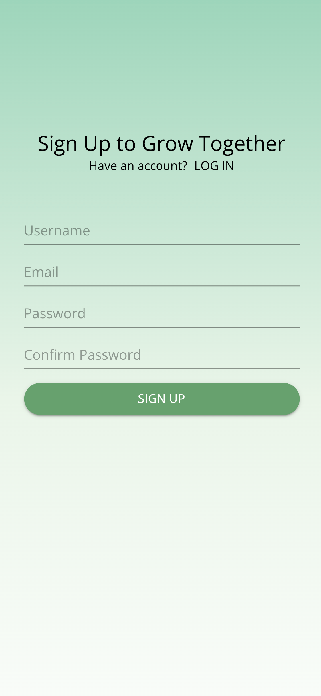
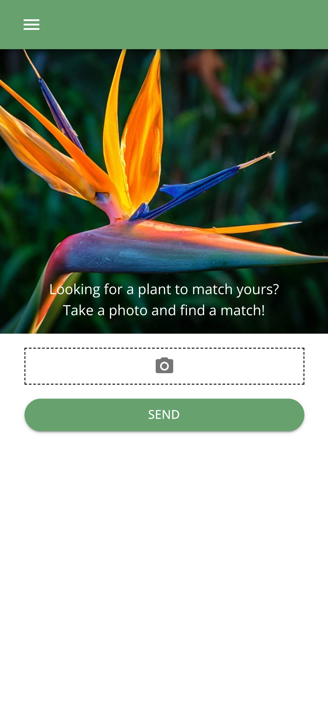
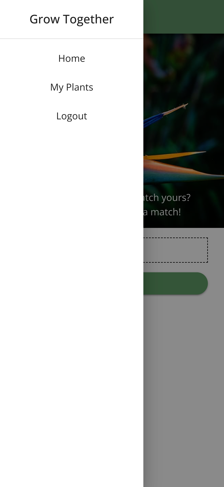
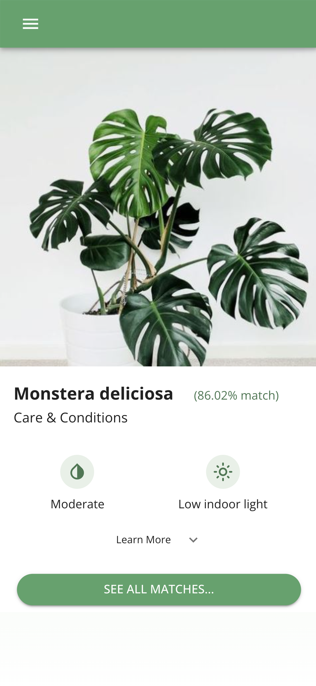
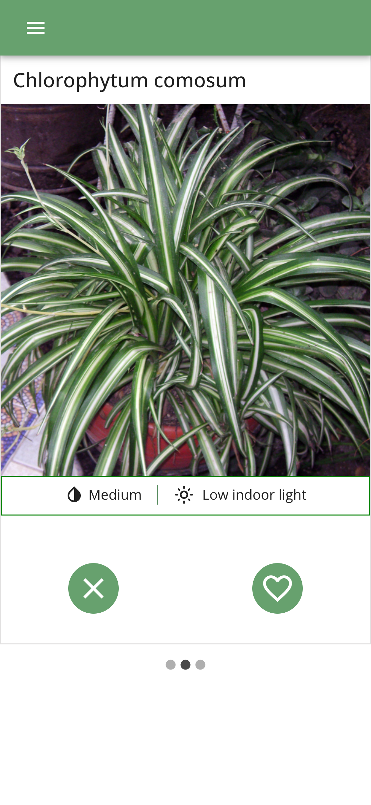
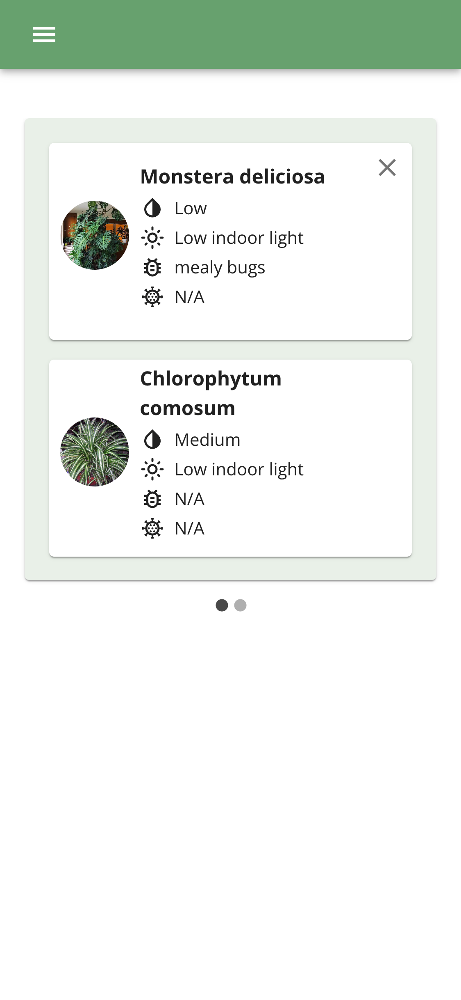

# Grow Together

## The App

Grow Together is a web app designed for plant lovers of all levels. The goal is to help owners select plants compatible with their existing collection to make integration seamless and as unstressful as possible.
By curating and matching one's plants to others like it based on watering needs, light requirements, and necessary maintenance levels, the user can ensure that future plants fit into their lifestyle and the aesthetic they like most.

## Technologies

The app was built with a Django REST API, and a ReactJS frontend. It connects to a PostgreSQL database.

- Python/Django
- Javascript/React
- MUI
- PostgreSQL

## Images

<table>
  <tr>
    <td>Log In</td>
    <td>Sign Up</td>
  </tr>
  <tr>
    <td>
    <td>
  </tr>
  <tr>
    <td>Home</td>
    <td>Side Menu</td>
  </tr>
  <tr>
    <td>
    <td>
  </tr>
  <tr>
  <tr>
    <td>Plant Identification</td>
    <td>Matches</td>
    <td>My Plants</td>
  </tr>
  <tr>
    <td>
    <td>
    <td>
  </tr>
 </table>

## Code

<ins>General</ins>

Users can upload a saved image or take a picture of plants using their phones. The app will send the image to PlantNet, a third-party API that uses deep learning technology to identify plants. After receiving the API's response, the app queries the database for that specific plant. The app returns plant matches based on similar conditions. The user can swipe between the matches and select one based on their needs. After the user selects a plant, the app will save the match and redirect the user to their dashboard.

<ins>Authentication</ins>  

- Django API and React authentication using JWT access and refresh tokens
- Persistent user login using secure http-only cookies
- Front and backend protected routes using Axios interceptors

## Team

<ins>Devs</ins>  
- Alexandre Lord 
- Ishan Khosla
- Nayab Kara

<ins>UX/UI Designers</ins>  
- Bianca Liu
- Tyannika Lam

## Icebox Features
